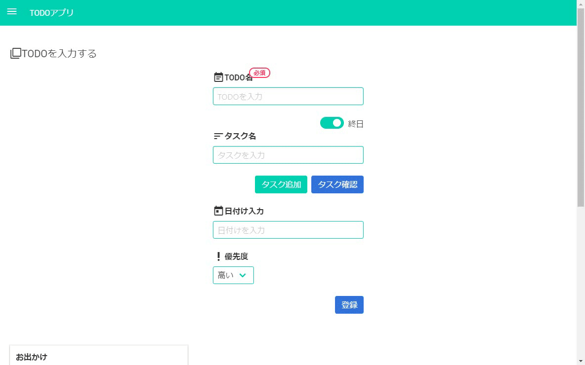
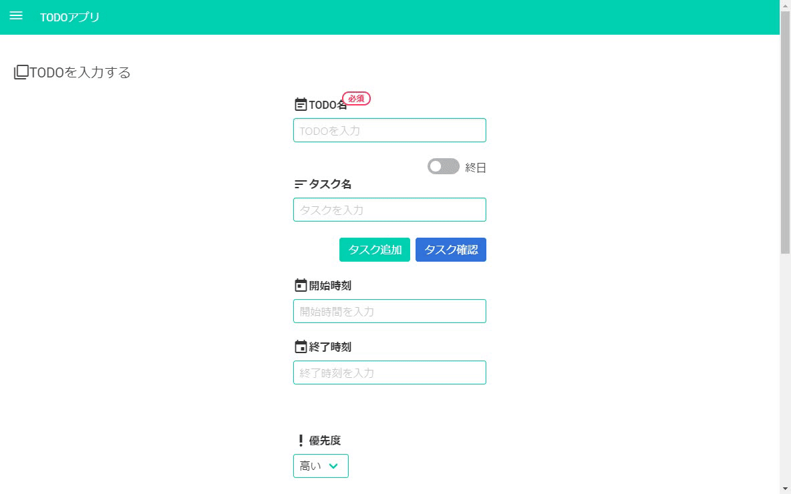

# TODO list made by Electron

## Description

Based on [last time made](https://github.com/dy0110/todo-app) I made a simple TODO application using Electron + jQuery + bluma.
You can search for saved TODO, and you can make a notification.

***DEMO:***  
Registration  
  
Search

Configuration


## Requirement

- Above Node.js v8.11.1
- [yarn v1.13.0](https://yarnpkg.com/lang/ja/)
- [Electron](https://electronjs.org/)
- [jQuery](https://jquery.com/)
- [simpler-sidebar](https://simple-sidebar.github.io/simpler-sidebar/)
- [Bluma](https://bulma.io/)
- [Bulma Modal FX](https://postare.github.io/bulma-modal-fx/)
- [Bluma extensions](https://wikiki.github.io/)
- [Bulma-toast](https://rfoel.com/bulma-toast/)
- [Google Material icon](https://material.io/tools/icons/?style=baseline)
- [flatpickr](https://flatpickr.js.org/) 
- [Dexie.js](https://dexie.org/)
- [validator.js](https://github.com/chriso/validator.js)
- [UUID.js](https://github.com/LiosK/UUID.js)
- [moment.js](https://momentjs.com/)
- [js-base64](https://github.com/dankogai/js-base64) 

## Installation

```
cd projects
git clone https://github.com/dy0110/electron-todo.git
```
## Usage

Please install yarn.

```
cd projects
yarn install
yarn start
```

## Impressions

- To use jQuery with Electron, it was serious as the assets of Node.js could not be used.
- It was convenient to store information in WebStorage.
- Bluma looks better than BootStrap and it was easy to use once you got used to it.
- I wanted to do until build, but I do not know how to make Mac's certificate and application icon.
- I want to challenge to rewrite this application as a study of Vue.js.

## Author
[Daichi Yoshida](https://github.com/dy0110)  

## License
[MIT](LICENCE)

Machine translation based on [Japanese version](doc/README.ja.md), so there is a possibility that the content is incorrect.  
[日本語版](doc/README.ja.md)をベースに機械翻訳したので内容に誤りがある可能性があります。