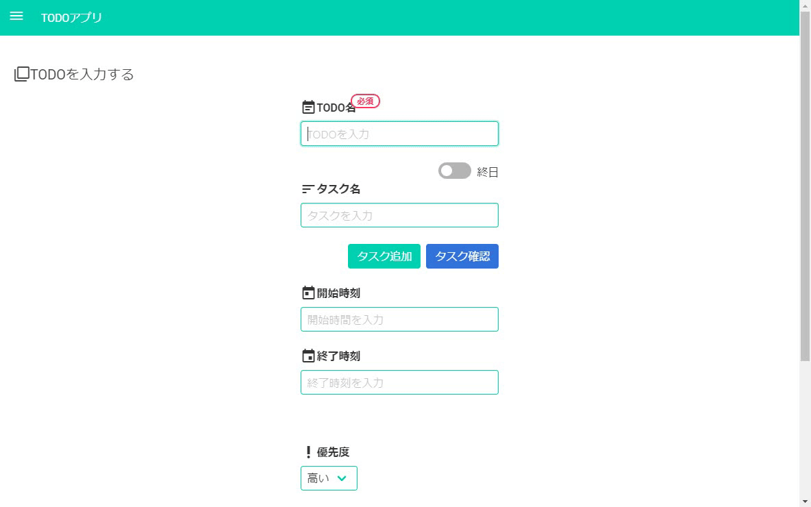
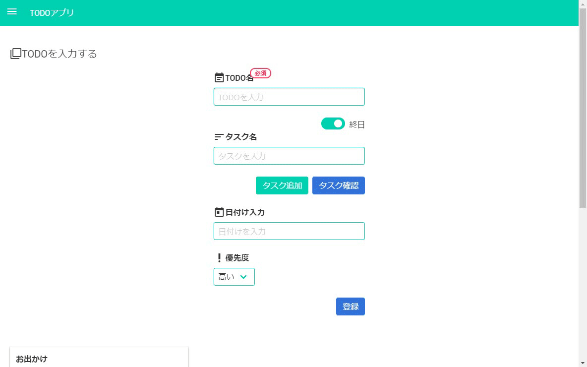

# Electron製のTODOアプリ

## 説明
[前回作ったもの](https://github.com/dy0110/todo-app)をベースにElectron+jQuery+blumaを使って単純なTODOアプリを作りました。
保存したTODOの検索ができたり、通知を出すことができます。

***DEMO:***  
登録  
  
検索

設定


## 依存関係

- Node.js v8.11.1 以上
- [yarn v1.13.0](https://yarnpkg.com/lang/ja/)
- [Electron](https://electronjs.org/)
- [jQuery](https://jquery.com/)
- [simpler-sidebar](https://simple-sidebar.github.io/simpler-sidebar/)
- [Bluma](https://bulma.io/)
- [Bulma Modal FX](https://postare.github.io/bulma-modal-fx/)
- [Bluma extensions](https://wikiki.github.io/)
- [Bulma-toast](https://rfoel.com/bulma-toast/)
- [Google Material icon](https://material.io/tools/icons/?style=baseline)
- [flatpickr](https://flatpickr.js.org/) 
- [Dexie.js](https://dexie.org/)
- [validator.js](https://github.com/chriso/validator.js)
- [UUID.js](https://github.com/LiosK/UUID.js)
- [moment.js](https://momentjs.com/)
- [js-base64](https://github.com/dankogai/js-base64)  

## インストール方法

```
cd projects
git clone https://github.com/dy0110/electron-todo.git
```

## 使い方
yarnをインストールしてください

```
cd projects
yarn install
yarn start
```
## 感想

- ElectronでjQueryを使うにはNode.jsの資産が使えなくなるので大変だった
- WebStrageに情報を保存でき、便利だった
- BlumaはBootStrapより見た目がよく、慣れれば使いやすかった
- ビルドまでやりたかったが、Macの証明書とアイコンを作る方法がよくわからない
- Vue.jsの勉強としてこのアプリの書き換えにも挑戦したい

## 作者 
[Daichi Yoshida](https://github.com/dy0110)  

## ライセンス
[MIT](electron-todo\LICENCE)